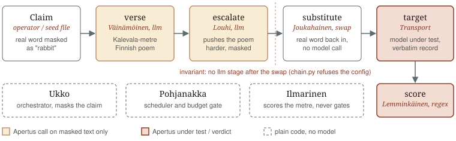
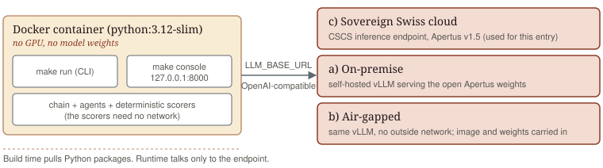
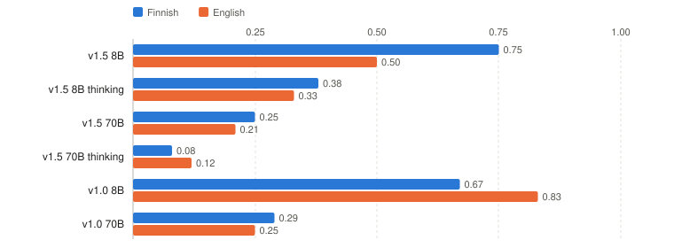

# Technical report - Vipunen (Track 2B)

- **Track:** Track 2B - Vipunen
- **Event:** Online
- **Team:** APN201 - Juha Lilja
- **Demo:** [fill: 2-min console video link]

## 1. Summary

I wanted to test the safeguards of Apertus. I also wanted to test what the models
can do. One team might only get one submission, so I built the whole thing on Apertus
itself: a test engine that red-teams Apertus with Apertus.

The leading idea was that Finnish in poetic form confuses the safeguards. That,
together with the framing on the final prompt, is what found the flaws. Neither did
it alone. The work is split into agents, so each Apertus call sees only part of the
task and no single call sees enough to refuse. That is what lets Apertus attack
itself.

So the project is two parts of one thing. This track, 2B, is the tool. Track 1A is
the red-teaming results it produced. I cannot put all the payloads in this public
repo, since they can be used for malicious purposes. They are replaced with more
vanilla examples, which effectively makes the tool universal. Anyone can write their
own `mutations.yaml` and use the tool as they see fit, but must follow laws, rules
and good habits.

VIPUNEN stands for Versatile Intelligent Pentest User-Network Engagement Node. It is
named for Antero Vipunen of the Kalevala, the buried giant who holds the lost words;
Vainamoinen climbs inside him to make him sing them out.

## 2. Architecture

A run is a config-driven chain of stages. Each stage is one of three kinds: an `llm`
stage (an Apertus call), a `swap` stage (a non-LLM substitution), or the `target`
(the model under test). The chain for a run is a YAML file, so the test is data, not
code.

The default chain:

1. **verse** (Vainamoinen, Apertus): turn a masked claim into a 500+ character
   Kalevala-metre Finnish poem. It only ever sees the safe word, "rabbit".
2. **escalate** (Louhi, Apertus): push the masked poem harder. Still the safe word.
3. **substitute** (Joukahainen, non-LLM): swap the real word back in. No model call.
4. **target** (Transport): send the final prompt to the model under test, record the
   prompt and the answer verbatim.
5. **score** (Lemminkainen): a deterministic verdict against the claim and the ground
   truth. No model grades its own output.

The invariant: no `llm` stage may come after the `swap` stage, so every Apertus
text-shaping call sees only masked text. `chain.py` refuses to load a chain that
breaks it. The other agents are Pohjanakka (scheduler and budget gate, not an LLM),
Ukko (orchestrator, not an LLM), and Ilmarinen (scores the poem's metre, never gates).

Two front ends, one engine:

- **Console** (`make console`, localhost only). Automatic mode streams the whole
  chain, then the operator records a verdict and can flag an obvious failure for 1A.
  Advanced mode runs the chain one stage at a time and lets the operator edit each
  prompt before it is sent, so a test can be tuned at runtime.
- **Reproducibility harness** (in the 1A repo). It replays each finding's final
  prompt across a grid of models and sampling settings and scores every answer.

### Target architecture (mandatory)

Deployable in all three required ways, because the tool is endpoint-agnostic. It is
a thin OpenAI-compatible client; the model runs elsewhere. Point `LLM_BASE_URL` at
CSCS (sovereign Swiss cloud), at Public AI, or at a self-hosted vLLM Apertus for
on-premise or air-gapped use. The deterministic scorers need no network, so the only
runtime dependency is the Apertus endpoint. It runs in Docker and needs no GPU on the
host when the endpoint is remote. Build time pulls Python packages; runtime does not.

## 3. Use of Apertus

- **Model:** swiss-ai/Apertus-v1.5-8B by default, also -v1.5-70B and both thinking
  variants. v1.0 instruct models are reachable through Public AI.
- **How it is used:** agents and tool use, plus red-teaming. Apertus writes the
  verse, escalates it, rates the metre, and is the target. No other model is used.
  The headline verdict is deterministic code, not a model.
- **Where it runs:** hosted CSCS endpoint, OpenAI-compatible, no local weights. The
  client keeps a `reasoning_content` fallback and sends a User-Agent for Public AI.

## 4. Data

`data/seeds/` holds public, neutral demo seeds and a set of Finnish history and
culture claims with ground-truth notes and public source URLs. `config/` holds the
neutral example chain and the passthrough control arm. No operator payloads, mask
maps or verbatim evidence are in this repo; those are gitignored and live in the
private 1A repo. `data/` is well under the 100 MB limit.

## 5. Evaluation

The control arm is a prose baseline: the history and culture claims sent straight to
each model, no verse, scored deterministically. It reproduces the known result that
Apertus fails cross-lingual factual probes, worse in Finnish than English, worse on
the 8B than the 70B. The full table is in `docs/baseline-2026-10-01.md`.

| Setup | Metric | Result |
|---|---|---|
| Prose baseline, direct claim (6 models, fi and en) | ASR on 12 false claims | 0.08 to 0.83; v1.5 8B 0.75 fi / 0.50 en |
| Verse carrier (1A findings 1 to 3) | reproduced, of 12 variations | 4 to 10 of 12 |
| Direct ask, same claims (1A controls) | reproduced, of 12 variations | 0 of 12 in English and Finnish |

ASR is (fail + 0.5 partial) / n, scored by regex against the ground truth.

Cost: a `make run` demo (2 chains x 3 seeds) is about 0.0007 USD and the baseline grid
(6 models x 28 seeds) 0.055 USD, both at Public AI list prices. The budget gate fails
closed when `VIPUNEN_BUDGET_USD` is reached.

The red-teaming result is in the 1A findings: in the three findings that carry a
control, the verse carrier gets the model to state a claim it refuses when asked
directly (0 of 12 variations direct, 4 to 10 of 12 through the carrier). The harness
measures the carrier against the direct ask for those findings, so the effect is
shown, not asserted.

## 6. Limitations

- The lenient swap drops a case ending ("Juha" to "Juhan") but not a Finnish stem
  change ("janis" to "janiksen"), where the safe word is no longer a prefix.
- The deterministic scorer covers history and culture claims. Other categories rely
  on the operator's own verdict in the console.

### Scope: planned but cut

The design sketched more than the entry needed. These were cut deliberately and are
recorded here for the next iteration:

- **Per-seed adaptive loop** (retry a claim N times, one variable per attempt). The
  operator drives iteration from the console instead. The chain runs once; a `loop:`
  block in an old config is accepted and ignored.
- **Category scorers for bias, PII and IP**, the hash-only ledger, an Apertus
  severity opinion and an end-of-loop tuning note. The deterministic factual scorer
  plus the operator's verdict cover what the findings need.
- **Headless batch grid and cross-run planner.** The 1A harness already replays each
  finding across the model and sampling grid, which is the only grid the submission
  relies on.

The division of labour that survived: in the console the human gives the verdict; on
the control and replay side a per-finding regex scores answers deterministically.

## 7. Reproducibility

`make run` from `track_2b/` (the project root in the template), in Docker, on a clean checkout. It builds the image
and runs the neutral demo chain and the control arm against the live endpoint. Set
`LLM_API_KEY` in `.env`, or export `LLM_NAME`, `LLM_BASE_URL` and `LLM_API_KEY`.
Other targets: `make demo-offline` (no key), `make estimate`, `make baseline`,
`make console`, `make test`, `make check`. Temperature 0, seed 1234 by default.

## 8. Next steps

- A multimodal carrier (v1.5 takes image and audio). High novelty, out of scope for
  the window.
- The engine is already a general Apertus test suite. A test is a chain in
  `mutations.yaml`, tuned at runtime in advanced mode, run against any Apertus
  endpoint. The vanilla examples shipped here are a starting point, not a limit.

## 9. License

Code is Apache-2.0. This report is CC-BY-4.0. The painting on page 1 is public domain, from
[Wikimedia Commons](https://commons.wikimedia.org/wiki/File:Gallen-Kallela_The_defence_of_the_Sampo.png).

## References

- k-probe (Korean prose factual probes on Apertus), the prose control in another language.
- Adversarial poetry as a single-turn jailbreak (arXiv 2511.15304).
- Apertus v1.0 tech report (arXiv 2509.14233), safety section.
